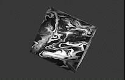

#### Rotate 3D cube with IMU.
That's a good idea to check that your axis mapping is correct. Let's use [AHRS](https://pypi.org/project/AHRS/)
and [Ursina](https://www.ursinaengine.org/entity_basics.html) for visualization.



```bash
    conda create --name 3D_Cube_AHRS python=3.10 pip
    conda activate 3D_Cube_AHRS
    pip install -r requirements.txt
    python main.py # Don't forget to connect your camera
    python main_kalman.py # Compare Mahony and Kalman AHRS
```

#### [OAK-D IMU](https://docs.luxonis.com/projects/api/en/latest/components/nodes/imu/) Coordinate system. Camera look at you:
```shell
  CW rotation around any axis gives Positive Gyro Values
    Imagine looking from a positive point on the axis and turing the entity right.
            X
            |
            |
            *--------Y  
             \ 
              \ 
               Z
```

#### Remap axis to your input system
There are many options of IMU location, many ways to map axis and even few ways to write the Quaternion.
I use python [AHRS](https://pypi.org/project/AHRS/) library for horizon estimation. 
It takes gyro+acc values to calculate Attitude and Heading and returns a quaternion.


#### [AHRS](https://pypi.org/project/AHRS/) Coordinate system:
Ahrs waits for next sequence: X, Y, Z
```shell
  CW rotation around any axis gives Positive Gyro Values
    Imagine looking from a positive point on the axis and turing the entity right.
        X
         \  
          \ 
            *--------Z  
            | 
            |  
            Y    
```

#### Remapping the OAK-D coord sys to match the direction and rotation of AHRS lib coord sys:
```python
AHRS_GYRO_X = -1 * OAK_GYRO_Z
AHRS_GYRO_Y = -1 * OAK_GYRO_X
AHRS_GYRO_Z =      OAK_GYRO_Y

AHRS_ACC_X = -1 * OAK_ACC_Z
AHRS_ACC_Y = -1 * OAK_ACC_X
AHRS_ACC_Z =      OAK_ACC_Y
```


#### [Ursina](https://www.ursinaengine.org/coordinate_system.html) coordinate system:
```shell
Entity Coordinate System:
  Positive value is clock-wise around axis.
    Imagine looking from a positive point on the axis and turing the entity left.
            y (up)
            |
            |
(forward) z |
          \ |
           \|
            *---------- x (right)
```

#### Remapping the AHRS coord sys to match the direction and rotation of Ursina lib coord sys:
```python
URSINA_QUAT_X =      AHRS_QUATE_Z
URSINA_QUAT_Y = -1 * AHRS_QUATE_Y
URSINA_QUAT_Z =      AHRS_QUATE_X
URSINA_QUAT_W = -1 * AHRS_QUATE_W
```
